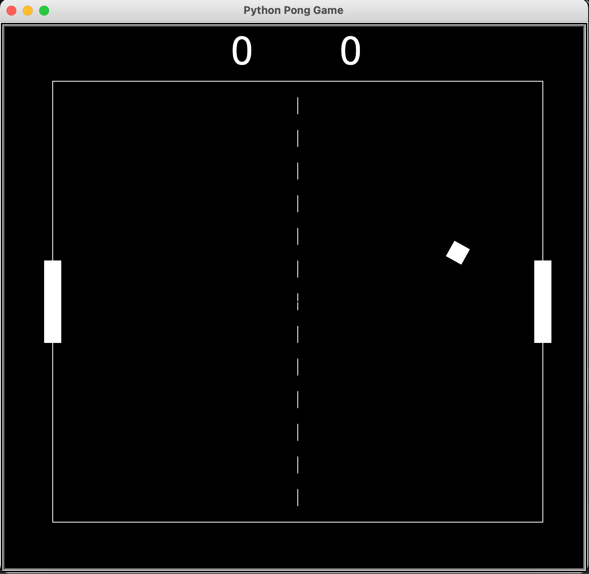

# Python Pong-game
This is my first version of Pong Game made in python.

A little bit of history here : https://en.wikipedia.org/wiki/Pong

And this is how it should work once it's fully done : https://www.ponggame.org

Thank you! 
